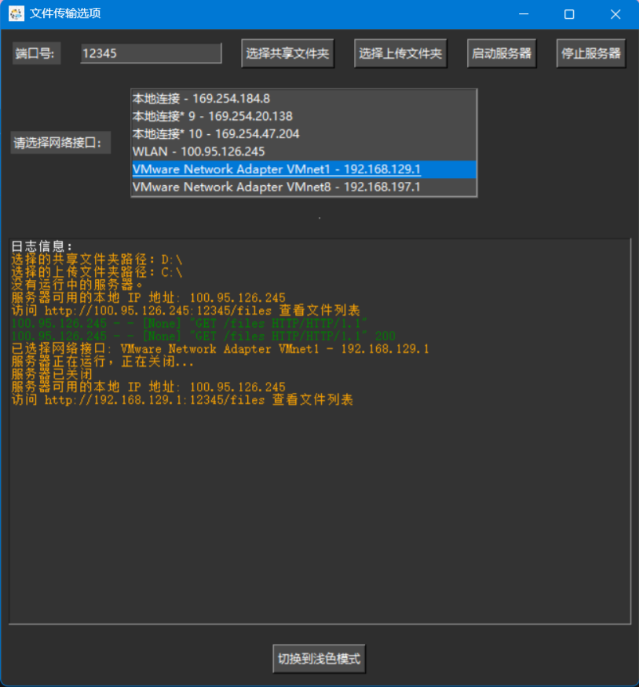

# 目录

- [下载地址](#下载地址)
- [功能](#功能)
- [程序结构](#程序结构)
- [介绍](#介绍)
- [安装和运行方式](#安装和运行方式)
  - [安装python库](#安装python库)
    - [运行程序](#运行程序)
      - [方法一](#方法一)
        - [方法二](#方法二)
    - [用法](#用法)
      - [创建证书 (使用自签名证书)](#创建证书-使用自签名证书)
      - [在程序执行目录添加证书](#在程序执行目录添加证书)
      - [注意事项](#注意事项)

## 下载地址

[点击此处进行下载](https://github.com/WorldDawnAres/FFTUSR/releases)

>打包文件Windows使用Python3.10.11版本打包可能不支持Windows7以下系统使用，Linux使用Python3.9.13版本打包。
>
> .exe 为Windows执行文件;不带扩展的为Linux可执行文件
> 
> 喜欢这个项目吗？请给我留个星 ⭐，让更多人看到它！感谢你的支持！

## 功能

- ✔️ 在局域网内共享指定文件夹
- ✔️ 其他设备可在HTML网页上上传文件
- ✔️ 支持Windows和Linux
- ✔️ 添加了上传进度条方便确定传输情况
- ✔️ 根据程序运行目录自动切换http或HTTPS协议（使用HTTPS需提供证书文件，默认使用HTTP）
- ✔️ 自动检测网口ip (可自定义选择启动程序的ip)
- ✔️ 可自定义端口号 (默认端口为12345)
- ✔️ 日志显示功能

## 程序结构

```bash
FFTUSR
├── /file_transfer
│   ├── /icon
│   │   ├── icon.jpg
│   │   └── config.json
│   ├── __init__.py 
│   ├── config.py
│   ├── file_utils.py
│   ├── html.py
│   ├── main.py
│   ├── ui.py
│   ├── tool.py
│   └── server.py
└── /README.md
```

## 介绍

>这个程序允许在局域网内共享指定文件夹,并支持其他设备上传文件到运行该程序的设备。
>
>程序使用Tkinter制作GUI界面,并支持HTTPS协议(只需在程序运行目录放置 .crt 和 .key 文件)。
>
>用户在使用时不选择共享文件夹和上传文件夹时会自动选择C盘和D盘为默认启动文件夹并且程序会默认使用HTTP协议。


>用户可以通过自定义的HTML界面下载和上传文件。用户可以选择自定义端口来开启服务。
>
>在程序运行时,用户可以点击选择共享文件夹和选择上传文件夹来自定义选择程序使用的文件夹,最后通过启动服务器来实现文件共享。
>
>程序的GUI界面支持日志显示,便于用户查看操作记录。



>此外程序还可以切换浅色和深色模式。


## 安装和运行方式

### 安装python库

>使用以下命令安装所需的Python库:

```bash
pip install gevent psutil flask pillow
pip install PyInstaller(可选)
```

### 运行程序

>你可以使用以下任一方式来运行程序：

#### 方法一

>使用 PyInstaller 打包程序：

```bash
PyInstaller -F --add-data "icon/*;icon" -i file-transfer\icon\icon.jpg main.py
```

>然后在 dist 目录下找到可执行文件。

#### 方法二

>直接运行 Python 脚本：

```bash
python main.py
```

### 用法

#### 创建证书 (使用自签名证书)

1. 安装 OpenSSL

Windows:可以从 OpenSSL for Windows 下载并安装。

macOS:可以通过 Homebrew 安装：

```bash
brew install openssl
```

Linux:大多数发行版都可以通过包管理器安装:

```bash
sudo apt-get install openssl  # Debian/Ubuntu
sudo yum install openssl      # CentOS/RHEL
```

2.创建私钥

```bash
openssl genrsa -out CA.key 2048
```

3.创建证书签名请求 (CSR)

使用生成的私钥创建证书签名请求 (CSR):

```bash
openssl req -new -key CA.key -out request.csr
```

在此步骤中,需要输入一些信息,例如国家、州、城市、组织名称等。确保填写这些信息,尤其是“Common Name”（CN），它通常是域名或服务器名称。

4.创建自签名证书

使用 CSR 和私钥创建自签名证书。您可以指定证书的有效期(例如,365 天):

```bash
openssl x509 -req -days 365 -in request.csr -signkey CA.key -out CA.crt
```

5.完成后，将获得以下文件：

```bash
CA.key:私钥文件。
request.csr:证书签名请求文件。
CA.crt:自签名证书文件。
```

#### 在程序执行目录添加证书

将创建证书步骤完成后将文件复制到如下示例文件夹下来开启HTTPS

```bash
├── /src                  # 下载exe程序后存放文件夹
│   ├── FFTUSR.v1.0.exe   # 文件传输程序
│   ├── CA.crt            # 证书文件
│   ├── CA.key            # 密钥文件
```

1.启动程序后，点击选择上传文件夹和选择共享文件夹。

2.点击“启动服务器”按钮。

3.通过程序日志访问提示在同一局域网下访问设备

#### 注意事项

1.确保在程序运行目录下放置 .crt 和 .key 文件以启用HTTPS。

2.如果没有添加证书，程序会默认使用HTTP协议。
