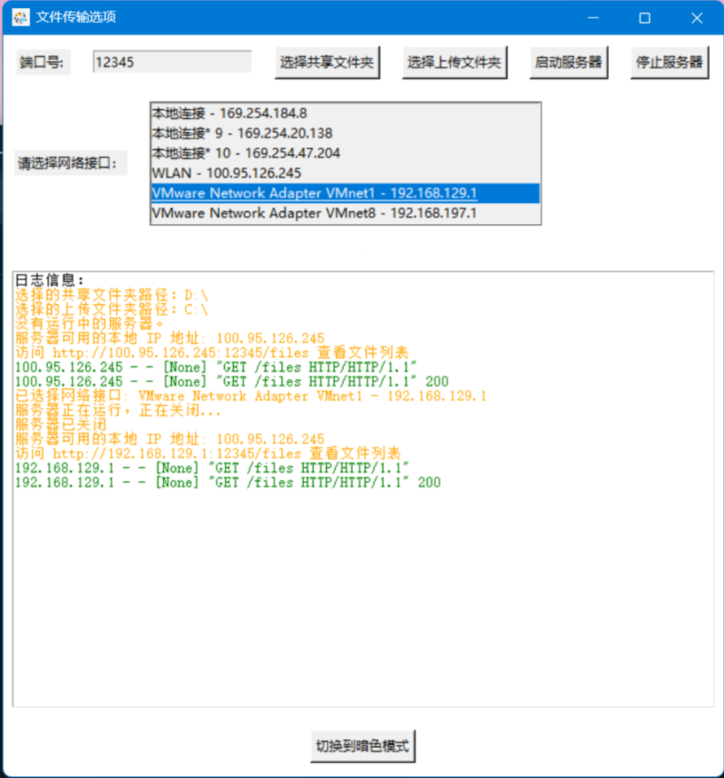

# Catalogue

**其他语言版本: [English](README_en.md), [中文](README.md).**

- [Catalogue](#catalogue)
  - [Download link](#download-link)
  - [Function](#function)
  - [Program structure](#program-structure)
  - [Introduction](#introduction)
  - [Installation and operation mode](#installation-and-operation-mode)
    - [Install Python library](#install-python-library)
    - [Run a program](#run-a-program)
      - [Method 1](#method-1)
      - [Method 2](#method-2)
    - [Usage](#usage)
      - [Create certificate (using self signed certificate)](#create-certificate-using-self-signed-certificate)
      - [Add a certificate to the program execution directory](#add-a-certificate-to-the-program-execution-directory)
      - [Precautions](#precautions)

## Download link

[Click here to download](https://github.com/WorldDawnAres/FFTUSR/releases)

> The .exe file in releases was packaged using Python 3.10.11 and may not support systems running Windows 7 or earlier.
>
> The Linux binary was packaged using Python version 3.9.13.
>
> Do you like this project? Please leave a star ⭐ so more people can see it! Thank you for your support!

## Function

- ✔️ Share specified folders within the local area network
- ✔️ Other devices can upload files on HTML web pages
- ✔️ Supports Windows and Linux
- ✔️ Added upload progress bar for easy confirmation of transmission status
- ✔️ Automatically switch between HTTP or HTTPS protocols based on the program's running directory (using HTTPS requires providing a certificate file, HTTP is used by default)
- ✔️ Automatically detect network port IP (customizable IP for program startup)
- ✔️ Customizable port number (default port is 12345)
- ✔️ Log display function

## Program structure

```bash
FFTUSR
├── /file_transfer
│   ├── /icon
│   │   ├── icon.jpg
│   │   └── config.json
│   ├── __init__.py 
│   ├── config.py
│   ├── file_utils.py
│   ├── html.py
│   ├── main.py
│   ├── ui.py
│   ├── tool.py
│   └── server.py
└── /README.md
```

## Introduction

>This program allows designated folders to be shared within a local network and supports file uploads from other devices to the device running this program.
>
>The program uses Tkinter to create the GUI interface and supports HTTPS protocol (just place .crt and .key files in the program's running directory).
>
>When users do not select shared folders or upload folders, the program automatically sets C drive and D drive as default startup folders and uses HTTP protocol by default.


>Users can download and upload files through a custom HTML interface. Users can choose custom ports to enable services.
>
>During program execution, users can click to select shared folders and upload folders to customize the folders used by the program, and finally achieve file sharing by starting the server.
>
>The GUI interface of the program supports log display, making it easy for users to view operation records.


>In addition, the program can also switch between light and dark color modes.



## Installation and operation mode

### Install Python library

>Use the following command to install the required Python libraries:

```bash
pip install gevent psutil flask pillow
pip install PyInstaller(optional)
```

### Run a program

>You can use any of the following methods to run the program:

#### Method 1

>Using PyInstaller to package programs:

```bash
PyInstaller -F --add-data "icon/*;icon" -i file-transfer\icon\icon.jpg main.py
```

>Then find the executable file in the dist directory.

#### Method 2

>直接运行 Python 脚本：

```bash
python main.py
```

### Usage

#### Create certificate (using self signed certificate)

1.Install OpenSSL

Windows: You can download and install OpenSSL for Windows.

macOS: You can install it through Homebrew:

```bash
brew install openssl
```

Linux: Most distributions can be installed through the package manager:

```bash
sudo apt-get install openssl  # Debian/Ubuntu
sudo yum install openssl      # CentOS/RHEL
```

2.Create a private key

```bash
openssl genrsa -out CA.key 2048
```

3.Create Certificate Signing Request (CSR)

Create a Certificate Signing Request (CSR) using the generated private key:

```bash
openssl req -new -key CA.key -out request.csr
```

In this step, some information needs to be entered, such as country, state, city, organization name, etc. Make sure to fill in this information, especially the "Common Name" (CN), which is typically a domain name or server name.

4.Create a self signed certificate

Create a self signed certificate using CSR and private key. You can specify the validity period of the certificate (e.g. 365 days):

```bash
openssl x509 -req -days 365 -in request.csr -signkey CA.key -out CA.crt
```

After completion, the following files will be obtained:

```bash
CA.key #Private key file.
request.csr #Certificate signature request file.
CA.crt  #Self signed certificate file.
```

#### Add a certificate to the program execution directory

After completing the certificate creation steps, copy the file to the following example folder and enable HTTPS

```bash
├── /src                  # Download the exe program and store it in a folder
│   ├── FFTUSR.v1.0.exe   # file transfer program
│   ├── CA.crt            # Certificate file
│   ├── CA.key            # key file
```

1.After starting the program, click on "Select Upload Folder" and "Select Shared Folder".

2.Click the "Start Server" button.

3.Accessing devices within the same local area network through program log prompts

#### Precautions

1.Ensure that the. krt and. key files are placed in the program's running directory to enable HTTPS.

2.If no certificate is added, the program will default to using the HTTP protocol.
